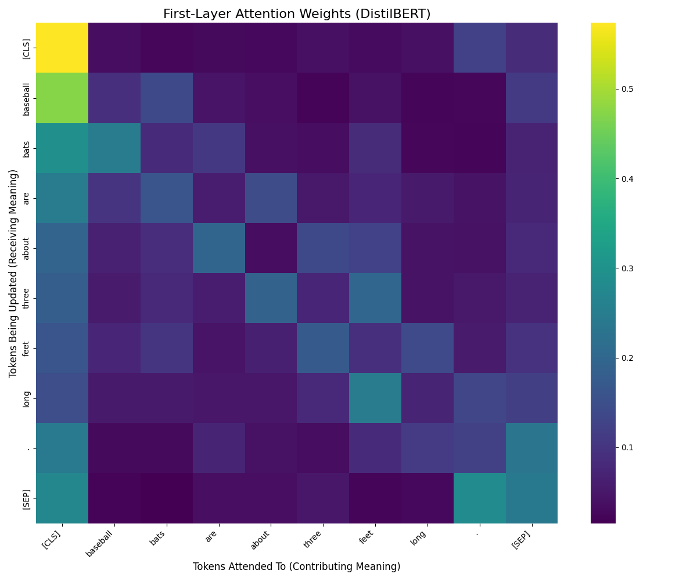
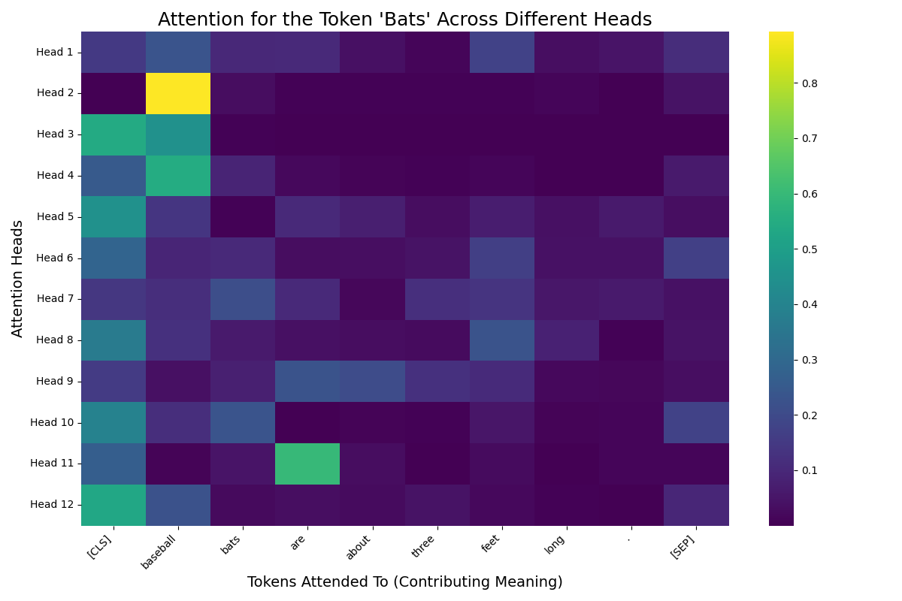

  ChatGPT Demystified  body { font-family: "warnock-pro", Palatino, "Palatino Linotype", "Palatino LT STD", "Book Antiqua", Georgia, serif; } h1, h2 { color: #2C3E50; } .navbar { margin-bottom: 20px; } .highlight-system { background-color: orange; font-weight: bold; } .highlight-user { background-color: lightblue; } .highlight-agent { background-color: lightgreen; } .markup { background-color: rgb(65, 65, 254); font-weight: bold; } .next-word { background-color: pink; } pre { padding: 10px; background-color: #f9f9f9; border: 1px solid #ddd; border-radius: 5px; overflow-x: auto; }

[ChatGPT Demystified](#)

*   [Home](#)
*   [Embeddings](/word2vec.html)
*   [Game](/game.html)
*   [Tokenizer](/tokenizer2.html)

ChatGPT Demystified
===================

An inside look into how ChatGPT predicts text and powers conversations.

_Based on the paper ["Language Models are Few-Shot Learners"](https://arxiv.org/abs/2005.14165) by Tom B. Brown et al._

Introduction
============

ChatGPT is a powerful language model that can generate human-like text. But how does it really work? In this guide, we'll take a deep dive into the inner workings of ChatGPT and explore the key concepts that allow it to generate coherent and context-aware responses.

Ever wondered how ChatGPT crafts its responses or maintains fluid conversations? This guide dives into the mechanics of ChatGPT, offering a simplified look at how it transforms text into coherent, context-aware replies. Drawing inspiration from the groundbreaking research paper "Language Models are Few-Shot Learners" by Tom B. Brown et al. (which describes how GPT-3, the precursor to ChatGPT was created) this guide breaks down the essential steps that ChatGPT uses to generate text.

From structuring inputs to predicting text, ChatGPT relies on three essential steps to deliver its responses. Whether you’re a tech enthusiast or simply curious about how AI works, this guide will shed light on the fascinating inner workings of language models. We’ll also introduce a fun, interactive way to grasp the concept of a language model—playing a prediction game that mirrors how ChatGPT thinks. By the end, you’ll gain a deeper appreciation for the science behind conversational AI and its role in shaping modern interactions.

How does ChatGPT work?
======================

ChatGPT uses three essential steps to respond to user prompts.

### 1\. Templating

First, your input and the conversation history are converted into a structured format that the model can understand. The template consists of a piece of text describing how the model should behave (called the system prompt) and a representation of the conversation history (past prompts and responses, and markup to indicate structure). Here is an example of what that might look like:

        \[System\] The following is a conversation between a helpful, knowledgeable AI agent and a user:
        \[User\] Respond with a single suggestion of something I could make for dinner
        \[Agent\] Lasagna
        \[User\] How would I make this?
        \[Agent\] 
    

### 2\. Generation

Second, ChatGPT uses a predictive language model to choose the most likely next word in this script, based on the preceding words. In the above example, “First,” “Here,” and “To” might be used. This is then appended to the conversation text:

        \[System\] The following is a conversation between a helpful, knowledgeable AI agent and a user:
        \[User\] Respond with a single suggestion of something I could make for dinner
        \[Agent\] Lasagna
        \[User\] How would I make this?
        \[Agent\] Here
    

Now this new text is fed back into the model and the next word is predicted again:

        \[System\] The following is a conversation between a helpful, knowledgeable AI agent and a user:
        \[User\] Respond with a single suggestion of something I could make for dinner
        \[Agent\] Lasagna
        \[User\] How would I make this?
        \[Agent\] Here is
    

This process repeats until the model predicts a special “word” called **End Of Sequence** (or `<EOS>`), which indicates the model’s response is complete.

        \[System\] The following is a conversation between a helpful, knowledgeable AI agent and a user:
        \[User\] Respond with a single suggestion of something I could make for dinner
        \[Agent\] Lasagna
        \[User\] How would I make this?
        \[Agent\] Here is a recipe for lasagna: https://thecozycook.com/easy-lasagna-recipe/<EOS>
    

What is a language model?
-------------------------

Lets play a game to understand how the language model powering ChatGPT works. Each round a word of the true sentence will be revealed, and both you and a language model will attempt to predict the next word.

**Note:** This is a simplified version of how ChatGPT works, using a less powerful model called Llama. The goal is to give you a hands-on experience of predicting words based on context.

What is a model?
----------------

Lets imagine you want to predict someones salary in a certain role. You could try to guess it based on your own intuition, but how do you know if your guess is justified?  
A mathematical model is a representation of a system, process, or concept using mathematical concepts and language.  
Lets make a very simple model to predict someones salary based on their years of experience. The equation will be:  
`salary = slope * experience + intercept`  
Where "slope" and "intercept" are numbers that we can adjust to make the model fit the data better. In this instance, the intercept represents the starting salary, and the slope represents how much the salary increases with each year of experience.

### "Training" a model

If I told you that someone with 2 years of experience makes $18/hour, and 2 people with 5 years of experience make $25 and $30/hour, could you use that information to make a better guess? This is the idea behind training. You use the relevant information you have to make a better guess.  
Lets see how this works in practice. Try adjusting the "slope" and "intercept" sliders to fit your model to the data.

But wait, how can a computer do this? Most people can eyeball a line and see how well it fits the data, but a computer needs a more systematic approach.  
First we need to define what "better" means. In this case, we can say that a better model is one that makes predictions that are closer to the true values.  
Specifically, we can define the "residual" as the difference between the true value and the value the model predicts. Click the button below to see the residuals for the current model.  
  
Show Residuals

Now, how can we adjust the slope and intercept to make the residuals closer to 0? This is where "gradient descent" comes in.  

Imagine you where to make a very small adjustment to the slope and intercept. Would the residuals get smaller or larger? If they get smaller, you should keep adjusting in that direction. If they get larger, you should adjust in the opposite direction.  
This is the basic idea behind gradient descent. You start with a random guess for the slope and intercept, and then adjust them in the direction that makes the residuals smaller.  

More about Model Training
---------------------------

Gradient descent is a very simple but powerful algorithm that is used to optimize the parameters of a model.  
However, it has a number of limitations on its own and has been extended in many ways to make it more powerful.  

##### Limitation 1: Gradient Calculation

One of the key challenges is getting this "gradient" (the direction we should adjust the parameters). In our simple model we can "make tiny adjustments" and re-run it but in more complex models this is not feasible.  
This is where "backpropagation" comes in. Backpropagation is a method used to calculate the gradient of very complicated, multi-layered models like ChatGPT.  
The basic idea is to calculate the gradient of the output of the model with respect to each parameter in the model. This is done by using the chain rule from calculus to calculate the gradient of each layer with respect to the layer before it.  
This is a very difficult concept to understand, but it is the key to training models like ChatGPT.  
Here are some resources to learn more about backpropagation:

*   [3Blue1Brown Video](https://www.youtube.com/watch?v=Ilg3gGewQ5U)
*   [Visual Explanation](https://xnought.github.io/backprop-explainer/)

##### Limitation 2: Local Minima

Another key limitation of gradient descent (and residual-minimizing training in general) is that it can get stuck in local minima. This is when the model finds a set of parameters that are better than the ones immediately next to it, but not as good as the best possible set of parameters.  
You can imagine local minima as a valley in a mountain range. If you start at the bottom of a valley, every direction you walk will take you up the mountain. But if you want to get to the lowest possible point on earth, you will have to climb out of the valley and find a new one.  
This is usually accomplished by more complicated optimization algorithms like "Adam" or "RMSProp".  

##### Limitation 3: Overfitting

A final major limitation of gradient descent is that it can lead to "overfitting". This is when the model learns the training data too well, and is unable to generalize to new data.  
You can think of this as a student who memorizes the answers to a test, but doesn't understand the underlying concepts. They will do well on that test, but will struggle with new questions.  
This is usually addressed by using more data, or by using "regularization" techniques that penalize the model for being too complex.  
The reason penalizing complexity works is the model doesn't have enough "room" to memorize the training data, and is forced to learn the underlying patterns.  
For example, in our salary model, if we had added a bunch of extra parameters (like the number of letters in the persons name, the color of their shoes etc) the model could have made a perfect prediction on our initial data by forming a hyperplane that connects every point, and has perfect accuracy.  
Mathematically, this is done by adding a term to the loss function that penalizes the model for having large weights. This makes the model prefer simpler explanations that generalize better.

Lets see how this works in practice. Click the button below to start the gradient descent algorithm.

Start Gradient Descent

Alright! now we have a trained model! Lets say we used the people in our team to train the model, and now we want to see how well it does on a random team within our company. This is called "testing" or "evaluating" the model. This is an especially important step because **models with predictive power** are more useful.

Click the button below to see how well our model does on an unseen dataset with similar characteristics.

Test Model

Pretty good! It seems like our model is able to predict the salary of people with a similar background to the people we used to train the model.  
This is the basic idea behind machine learning. You use data to train a model, and then test it on new data to see how well it generalizes.  
ChatGPT is vastly more complicated, but it operates on the same principle. In its case, however, instead of 2 sliders it has over **1.5 billion parameters** that it adjusts to make the best predictions it can. As you can imagine, training a model like ChatGPT is a massive undertaking that requires a lot of data and computational power.

Under the Hood
--------------

OK, so how does ChatGPT actually predict the next word? Whats the intuition behind what these billions of parameters mean? Here's a simplified version of ChatGPT's inner workings:

1.  First, the text is **broken into tokens**. These are usually words, but can be fragments of words
2.  Next, the model tries to **represent each token with an embedding** (a list of numbers that encodes the word's meaning).
3.  Then, the model repeatedly
    1.  **updates the meaning** of each token based on the surrounding context
    2.  Each time it updates the meaning, it will also **bake world knowledge** into the meaning
4.  Finally, the model **predicts the next word** based on the meaning of the text so far

Understanding each of these steps in more detail can help you understand how ChatGPT works and what its strengths and limitations are.

### Step 1: Tokenize the text

Tokenization is the process of breaking text into smaller pieces called tokens. These tokens can be words, subwords, or characters, depending on the model and the task.  
Lets see how this works in practice. Enter some text in the box below and click the "Tokenize" button to see how the text is broken into tokens. You can then click the "Convert to Token IDs" button to see how the tokens are represented as numbers to be fed into the model.

### Step 2: Embed the tokens

Now we have a bit of a problem. Since our language model is a mathematical function we need some way to represent these words as numbers. More difficult still, we need to represent them in a way that captures their meaning so that the model can actually learn from them.  
This is where "word embeddings" come in. Word embeddings are a way to represent words as a list of numbers in a way that captures their meaning. These numbers are not assigned, but learned by the model as it reads through millions of examples of text.  
Lets start with looking at what a word embeddings for the word "cat" looks like:

const catvec = wordVecs\['cat'\]; const catvechtml = catvec.map((v) => \`${v.toFixed(2)}\`).join(', '); document.getElementById('catvec').innerHTML = \`<code style="font-size:10px">\[${catvechtml}\]</code>\`;  
Ohh no. That's a lot of numbers. How can we make sense of this?  
Well maybe a good place to start is to see which words have similar embeddings. Lets see which words have embeddings that are close to the word "cat".  

But wait there's more! The embeddings represent more than distances between words. They can also do some simple analogies if we think of them mathematically. For example, what does "brother" - "man" + "woman" equal? Lets see if this is encoded in these embeddings!

Pretty cool right? These embeddings can capture some of our intuitions about language.  
More precisely, **directions in these embeddings encode properties of the words**. This is why "brother" - "sister" is very similar to "man" - "woman". They are both encoding the concept of gender.

More about embeddings
-----------------------

Word embeddings are a type of word representation that allows words with similar meanings to have similar representations. They are learned from data and are able to capture semantic relationships between words.  
There are many ways to learn word embeddings, but one common method is to use a neural network to predict the context of a word based on its surrounding words. The weights of the neural network are then used as the word embeddings.  
These word embeddings are a smaller version of the [Word2Vec](https://en.wikipedia.org/wiki/Word2vec) embeddings, which are trained on a large corpus of text to capture the meaning of words.  
_Note: GPT does not use Word2Vec embeddings directly, Word2Vec is just a common example of word embeddings with relatively few dimensions. GPT uses embeddings with 768 dimensions, making them more difficult to work with.  
Both of the demonstrated phenomena (Similarity and analogies) have been demonstrated for GPT embeddings as well._

  

### Step 3: Update the token meanings

Word embeddings are pretty neat, but you may have noticed a problem. The same word can have dramatically different meanings depending on the context.  
For example, "bat" can refer to a flying mammal, a piece of sports equipment, or a verb meaning to hit something.  
This is by far the most difficult part of the language model. In fact, this method of updating the meaning of words based on context is the main innovation that paved the way for chatGPT.  
To do this, the model runs the embeddings through a series of "layers" that look at all the embeddings and update them all together.  
You can think of this like the model assigning an initial meaning to each word, then editing each meaning to make the text make more sense as a whole.  

#### A Motivating Example

Lets think about the word "bat" again. Lets see how the model embeds the word "bat" in a variety of contexts, and see if we can separate the meanings.  
To do this, we will look at a special projection of the embeddings called "t-SNE". The exact workings are not important, but the key idea is it tries to keep distances and structure between the embeddings on a 2 dimensional graph similar to the original distances

As you can see, the model is able to separate the different meanings of the word "bat" into different regions of the graph. But how does it do this?  
Its easiest to see this by looking through each layer of the model and seeing how the embeddings change. Click the "Next Layer" button below to see how the embeddings change as they pass through the model.

As you can see, the embeddings change dramatically as they pass through the model, and capture more and more information about the context of the word.  
Technically, this is accomplished through a process called "attention". You can think of this as the model adjusting the meaning of a word by first deciding which other words are most important, then updating the meaning based on those words.

But what is attention _really_ doing?
---------------------------------------

Attention is a mechanism that allows a model to focus on certain parts of the input when making predictions.  
In the case of language models like GPT, attention is used to decide which words are most important when updating the meaning of a word.  
In the below example, you can see what the model is "paying attention to" when updating the meaning of the words in a sentence.

An example of an attention heatmap in a language model. Keep in mind this is only the first layer, and the "heads" (parts of the model that pay attention to different parts of the input) have been averaged

From this heatmap, you can see that the model updates the meaning of "bat" based on the word "baseball" (row 3 col 2) more than the word "baseball" based on the word "bat" (row 2 col 3).  
This aligns with our intuition, that we learn more about the meaning of "bat" from the word "baseball" than the other way around.  
_Note: \[CLS\] and \[SEP\] are special tokens that the model uses to mark the beginning and end of a sentence. Interpreting their attention values is more difficult._  
  
Looking at a single head mathematically, It consists of "query" vectors, "key" vectors, and "value" vectors. The steps are as follows, for each query / key pair:

1.  Calculate the Query vector for each word by multiplying the word embedding by the query vectors. You can think of it like the word "asking questions" about its context
2.  Calculate the Key vector for each word by multiplying the word embedding by the key vectors. You can think of it like the word "answering questions" about its context

After this, the next steps for each word are:

1.  Calculate the attention score for each word by taking the dot product of the query and key vectors. This tells us how much the word "cares" about the other word (how much it answers its questions)
2.  Normalize the attention scores by applying a softmax function. This makes the scores add up to 1, so they can be used as weights

  
This can be very difficult to visualize, as neither the query nor key vectors are directly interpretable. But the idea is the model uses these vectors to decide which words are most important when updating the meaning of a word. In practice, it helps to have multiple "heads" that can capture different patterns in the data. At the end of each layer, the model combines the information from all the heads to update the meaning of each word. Below you can see what each head is paying attention to when updating the meaning of the word "bats" in the sentence "Baseball bats are about three feet long.".

An example of what each "head" in the model is paying attention to when updating the meaning of "bats". Each row represents a different head, and each column represents a different word in the input.

For more information on attention, check out the following resources:

*   This incredible [3B1B Video](https://www.youtube.com/watch?v=eMlx5fFNoYc)
*   Original Transformer architecture paper: [Attention is All You Need](https://arxiv.org/abs/1706.03762)
*   [The Illustrated Transformer](https://jalammar.github.io/visualizing-neural-machine-translation-mechanics-of-seq2seq-models-with-attention/)

  

### Step 4: Bake in world knowledge

Okay, so the model can update the meaning of words based on context. But there is much more to language than just understanding sentences on their own.  
For example, if I say "Michael Jordan is the greatest player of all time" you probably know I'm talking about basketball, even if I never mentioned the sport.  
Some of this knowledge is already present in the embeddings, such as capitol - country relationships.  
But there is way too much information to cram into even very large embeddings. This is where the models "MLP" (Multi Layer Perceptron) layer comes in.  

#### Steps of adding this information

The model is really doing 2 things in this layer. The first is asking a series of questions about the current embeddings, and the second is adding that information into the embeddings.  
These questions are _almost_ yes / no. The primary reason they are not is to allow the model to train more effectively by making small adjustments.  
Some of examples of questions the model might "ask the embeddings" in the first layer are:

*   Is this Micheal Jordan?
*   Is this the Soviet Union in 1970?
*   Is this "The Godfather"
*   Is this a bat that flies?

**Note that these are questions that can be answered with only the sentence itself**.  
The model then uses its "knowledge" to construct new embeddings, that add the additional world information to the embeddings.  

How do you "ask a question" mathematically?
---------------------------------------------

One of the the foundations of neural networks is "matrix multiplication". This is where all the processing actually happens.  
Since the embeddings are a list of numbers (known as a vector), these matrix multiplications can be thought of as a series of "dot products" between the rows of the matrix and the embedding.  
A dot product is a way to multiply two vectors together to get a single number. This number represents how similar the two vectors are.  
So to "ask a question" of the embeddings, the model multiplies the embeddings by a matrix that represents the question.  
The result is a list of numbers that represent how similar the embeddings are to the question. This is then used to update the embeddings.  
After these dot products are calculated, they are passed through a function which throws away negative values. This is called a "ReLU" function, and is used to convert these similarities into almost yes / no answers.  
  

##### A Simplified Example

In 2 dimensions, you could imagine the embedding as a line pointing from the center in a certain direction.  
You can then imagine a question as a line pointing in a different direction. The dot product of these two lines will be greater the more similar the two lines are.  
See the visualization below to play around with this idea.

As the model goes through more layers, it can ask more complex questions and work with information integrated from previous layers.  
The actual questions asked by the model are very difficult to interpret directly, but we can create our own questions and see if the model can answer them.  
This is easiest if we just focus on names, since the correct interpretation of them is almost entirely dependant on prior knowledge.  

### Step 5: Predict the next word

Finally, the model uses the updated meanings of the tokens to predict the next word in the sequence. This is done by running the embeddings through a final layer that converts them into probabilities over the vocabulary.  
The model then selects the word with the highest probability as the next word in the sequence.  
Lets see how this works in practice. Enter a sentence in the box below and click the "Predict Next Word" button to see what the model predicts.

### Putting it All Together

Throughout this explanation, we have glazed over many of the exact details of how the model works.  
However, If you understood everything up to this point, I believe you can understand the basic idea of how ChatGPT works.  
Below is a complete interactive diagram of the model, where you can see exactly what happens at each layer.

Conclusion: What Have Language Models Learned?
----------------------------------------------

*   **Consequences from data**
    *   Biases reflected in model
    *   Efficacy of prompting
*   **Consequences from architecture**
    *   Vastly improved performance over longer pieces of text
    *   Difficult to parse very large amounts of data, computational explosion vs RNNs
    *   Has issues with precise rules, eg parentheses matching or arithmetic vs reasoning models
    *   Difficult to validate data from model vs knowledge graphs

Under Construction

To do/fix
---------

*   Narrative clarity
*   Condensing information
*   Preserving technical accuracy while keeping it accessible and as complete as possible
*   Provide actionable insights
*   Maybe add some information about new developments

var pushOrigin = '\*' // if we are on centipede5.github.io updata if (window.location.hostname == 'centipede5.github.io') { pushOrigin = 'https://centipede5.github.io' } const showRisidualsButton = document.getElementById('showRisiduals'); showRisidualsButton.addEventListener('click', function(e){ // check button e.target.classList.toggle('btn-primary'); e.target.classList.toggle('btn-secondary'); e.target.innerHTML = e.target.innerHTML == 'Show Residuals' ? 'Hide Residuals' : 'Show Residuals'; // signal iframe const iframe = document.getElementById('modeliframe'); const message = { type: 'show\_loss', } iframe.contentWindow.postMessage(message, pushOrigin); //scroll to modeliframe iframe.scrollIntoView(); }); const startGradientDescentButton = document.getElementById('startGradientDescent'); startGradientDescentButton.addEventListener('click', function(e){ // signal iframe const iframe = document.getElementById('modeliframe'); const message = { type: 'start\_gradient\_descent', } iframe.contentWindow.postMessage(message, pushOrigin); //scroll to modeliframe iframe.scrollIntoView(); }); const testModelButton = document.getElementById('testModel'); testModelButton.addEventListener('click', function(e){ // signal iframe const iframe = document.getElementById('modeliframe'); const message = { type: 'generate\_data', } iframe.contentWindow.postMessage(message, pushOrigin); //scroll to modeliframe iframe.scrollIntoView(); });